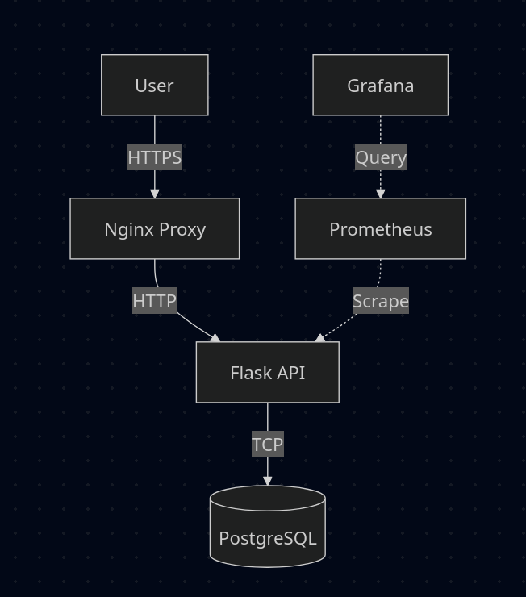

# Branch Loan API

A containerized Flask API for managing microloans, featuring a complete DevOps pipeline with CI/CD, monitoring, and multi-environment support.


## Architecture

Traffic flows through Nginx (SSL termination) to the Flask API, which connects to PostgreSQL. Prometheus scrapes metrics from the API, visualized in Grafana.




## Prerequisites

-   **Docker** and **Docker Compose**
-   **Make** (Optional)
    -   Ubuntu/Debian: `sudo apt-get install make`
    -   Mac: `brew install make`
    -   Windows: `choco install make`

## Setup & Usage

1.  **DNS Setup**: Map the local domain.
    ```bash
    echo "127.0.0.1 branchloans.com" | sudo tee -a /etc/hosts
    ```

2.  **Start Application**:
    You can use `make` for simplicity, or standard `docker-compose` commands.

    | Action | Make Command | Docker Command |
    |---|---|---|
    | **Start (Dev)** | `make up` | `docker-compose up -d --build` |
    | **Stop** | `make down` | `docker-compose down` |
    | **View Logs** | `make logs` | `docker-compose logs -f` |
    | **Check Status** | `make ps` | `docker-compose ps` |

3.  **Verify**:
    -   API: `https://branchloans.com/health`
    -   Metrics: `https://branchloans.com/metrics`

## Environments

| Environment | Config File | Logging | Restart Policy |
|---|---|---|---|
| **Development** | `docker-compose.override.yml` | DEBUG | No |
| **Staging** | `docker-compose.staging.yml` | INFO | On-Failure |
| **Production** | `docker-compose.prod.yml` | INFO (JSON) | Always |

To switch environments:
```bash
# Staging
docker-compose -f docker-compose.yml -f docker-compose.staging.yml up -d --build

# Production
docker-compose -f docker-compose.yml -f docker-compose.prod.yml up -d --build
```

## Monitoring

-   **Prometheus**: [http://localhost:9091](http://localhost:9091)
-   **Grafana**: [http://localhost:3000](http://localhost:3000) (Default: `admin`/`admin`)

## CI/CD Pipeline

The GitHub Actions workflow (`.github/workflows/ci-cd.yml`) handles:
1.  **Test**: Unit tests and linting.
2.  **Secret Scan**: Scans for hardcoded secrets using **Gitleaks**.
3.  **Build**: Multi-stage Docker build.
4.  **Vuln Scan**: Security vulnerability scanning with **Trivy**.
5.  **Push**: Uploads to Docker Hub (main branch only).

## Troubleshooting

-   **502 Bad Gateway**: The API container is likely crashing. Run `docker-compose logs api` to debug.
-   **Port Conflicts**: Ensure ports 80, 443, and 5432 are free.
-   **No Metrics**: Prometheus requires traffic to generate data. Run `curl -k https://branchloans.com/health` a few times.
-   **Make not found**: If you cannot install `make`, simply use the Docker commands listed in the "Setup & Usage" section.

---

## ✅ Project Status

### Core Requirements
-   ✅ **Containerization**: Dockerized API & DB with Nginx for SSL termination.
-   ✅ **Multi-Environment**: Dev (Hot-reload), Staging, and Production (Secure & Optimized).
-   ✅ **CI/CD Pipeline**: Automated Build, Test, and Security Scans (Trivy & Gitleaks).
-   ✅ **Documentation**: Clear setup guides, architecture diagrams, and troubleshooting.

### Bonus & "Extra Mile" Features
-   🌟 **Observability**: Real-time monitoring with **Prometheus & Grafana**.
-   🌟 **Security**: Added **Gitleaks** to catch secrets before they hit the repo.
-   🌟 **Production Logging**: Structured JSON logs for better debugging.
-   🌟 **Resilience**: Robust `/health` checks that actually verify DB connectivity.
-   🌟 **Developer Experience**: Added a `Makefile` to save time on typing commands.